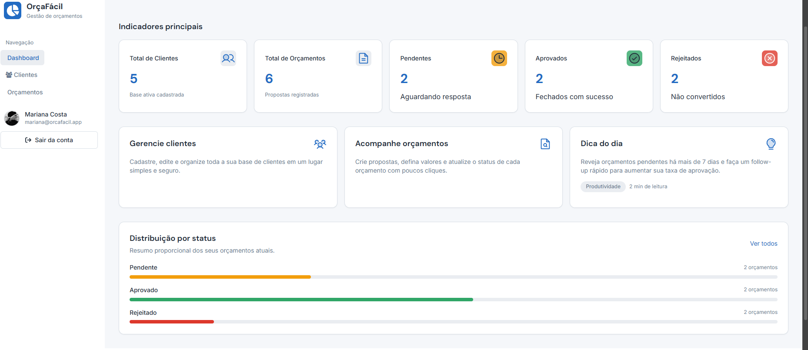
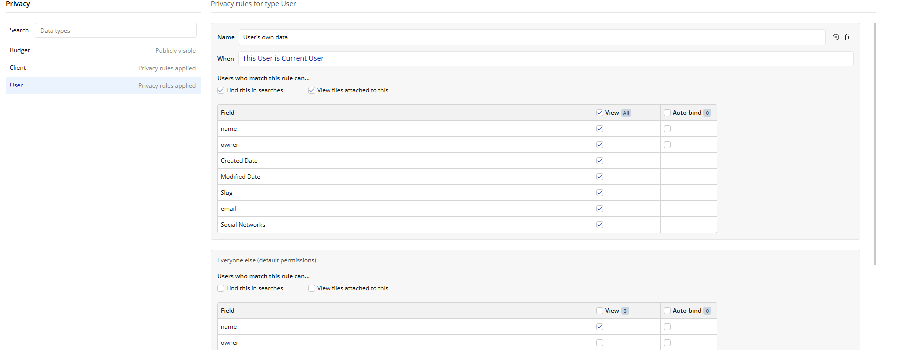
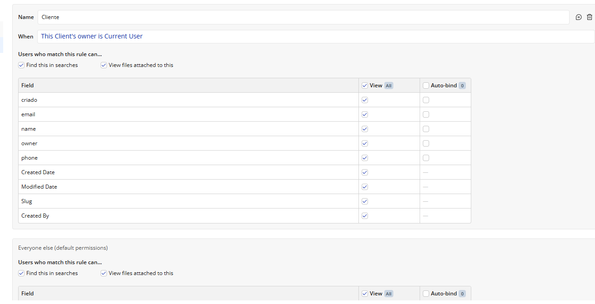
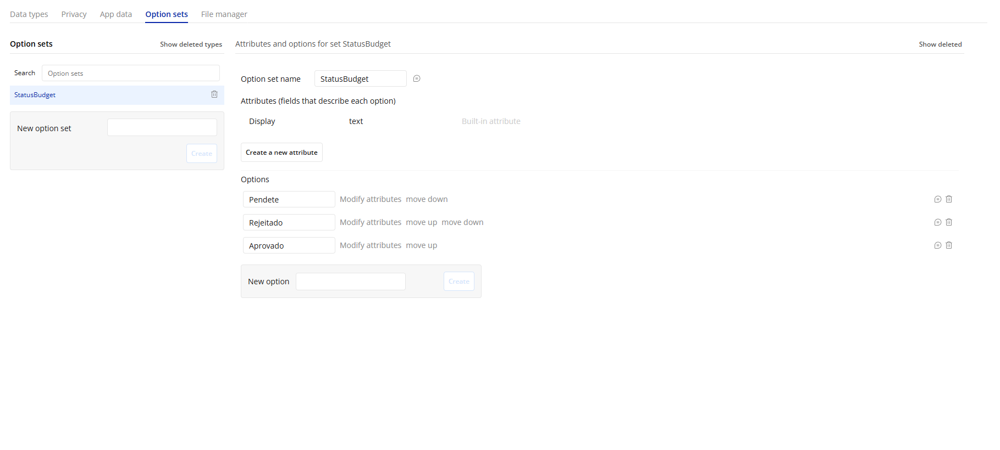
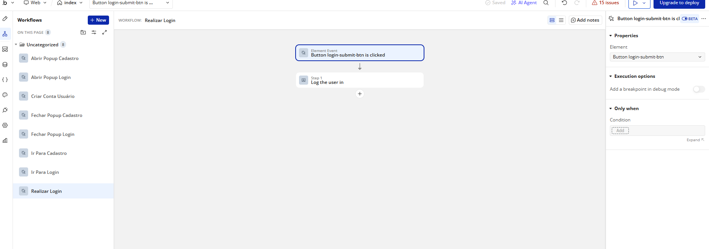
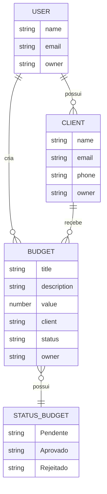

# OrçaFácil - Sistema de Gestão de Orçamentos no Bubble

## 📌 Descrição

O **OrçaFácil** é uma aplicação web simples para gestão de clientes e orçamentos, criada com o auxílio da Inteligência Artificial do Bubble e revisada manualmente com foco em fundamentos de engenharia de software.

O sistema permite cadastrar clientes, criar orçamentos, acompanhar status e manter os dados protegidos por usuário através das regras de privacidade do Bubble.

---

## 🔗 Link da Aplicação

👉 [Acessar o OrçaFácil](https://pedrolucasp503-73718.bubbleapps.io/version-test?debug_mode=true)

---

## 🖼️ Prints do Projeto

### Dashboard

Tela principal com indicadores e acesso às funcionalidades do sistema.

---

### Regra de Privacidade — User

Configuração de privacidade para permitir que cada usuário acesse apenas seus próprios dados.

---

### Regra de Privacidade — Client

Regra aplicada ao tipo de dado `Client`, garantindo que cada usuário visualize somente seus próprios clientes.

---

### Option Set — StatusBudget

Criação do Option Set responsável pelo controle dos status dos orçamentos.

---

### Workflows

Organização dos workflows utilizados no funcionamento da aplicação.

---

## ⚙️ Funcionalidades

- Cadastro e login de usuários.
- Dashboard com indicadores principais.
- Cadastro, visualização e organização de clientes.
- Cadastro e acompanhamento de orçamentos.
- Status de orçamento por Option Set: `Pendente`, `Aprovado` e `Rejeitado`.
- Regras de privacidade para isolamento de dados por usuário.
- Organização dos workflows para facilitar manutenção.
- Estrutura preparada para possível migração futura.

---

## 🗄️ Modelagem de Dados

### User

- name
- email
- owner

### Client

- name
- email
- phone
- owner

### Budget

- title
- description
- value
- client
- status
- owner

---

## 🧱 Modelo Entidade-Relacionamento — MER

---

## 🔐 Segurança e Privacidade

Foram configuradas **Privacy Rules** no Bubble para impedir que um usuário visualize os dados criados por outro usuário.

Regras principais:

- **User:** This User is Current User
- **Client:** This Client's owner is Current User
- **Budget:** This Budget's owner is Current User

Essas regras garantem que cada usuário tenha acesso apenas às informações vinculadas à sua própria conta.

---

## 🏷️ Option Sets

Foi criado o Option Set `StatusBudget`, evitando o uso de textos fixos diretamente no sistema.

### Opções disponíveis:

- Pendente
- Aprovado
- Rejeitado

O uso do Option Set melhora a organização do sistema e facilita futuras alterações nos status.

---

## 🔄 Workflows

Os workflows foram organizados e renomeados para facilitar a manutenção e a leitura do funcionamento interno da aplicação.

Também foram adicionadas notes explicando a função dos principais fluxos, deixando o projeto mais compreensível para futuras melhorias.

---

## 🧠 Uso de Inteligência Artificial

O projeto foi desenvolvido com apoio da Inteligência Artificial do Bubble, principalmente para acelerar a criação inicial da aplicação.

Após a geração inicial, o sistema foi revisado manualmente, com ajustes em:

- Estrutura dos dados
- Regras de privacidade
- Organização dos workflows
- Option Sets
- Governança do projeto
- Documentação para entrega acadêmica

---

## 🧩 Estratégia de Saída

Caso o sistema precise ser migrado futuramente, os dados poderão ser exportados utilizando a **Data API do Bubble** em formato JSON.

Dessa forma, será possível reutilizar as informações em aplicações desenvolvidas com tecnologias tradicionais, como:

- React
- Node.js
- APIs REST
- Bancos de dados SQL
- PostgreSQL
- MySQL

---

## 📚 Aprendizados

Durante o desenvolvimento deste projeto foram aplicados conceitos de:

- Engenharia de software
- Modelagem de dados
- Regras de privacidade
- Organização de workflows
- Desenvolvimento no-code
- Uso de Inteligência Artificial no desenvolvimento
- Governança e documentação de sistemas

---

## 📌 Status do Projeto

✅ Projeto funcional  
🚧 Melhorias futuras podem ser implementadas

---

## 👨‍💻 Autor

Desenvolvido por **Pedro Lucas Machado Lopes**

- GitHub: [Pedroloopess](https://github.com/Pedroloopess)
- Portfólio: [portfolio-pedro-lucas-machado-lopes](https://github.com/Pedroloopess/portfolio-pedro-lucas-machado-lopes)

---

## 📝 Licença

Este projeto foi desenvolvido para fins acadêmicos e de portfólio.
