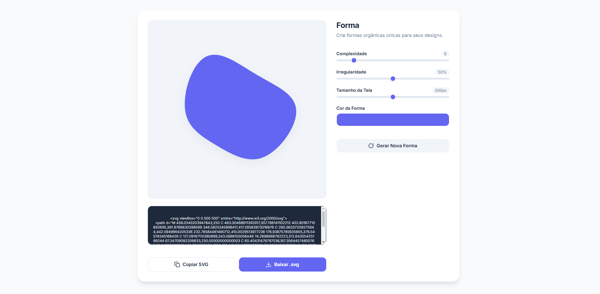
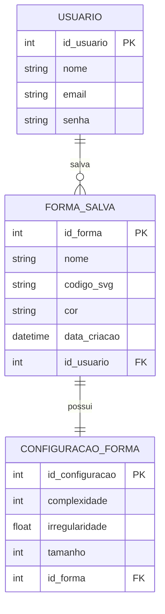

# 🎨 Forma — Gerador de Formas Orgânicas

## 📌 Descrição do Projeto

O **Forma — Gerador de Formas Orgânicas** é uma aplicação web criada para gerar formas orgânicas em SVG de maneira simples, rápida e personalizável.

O projeto permite ao usuário modificar características da forma, como complexidade, irregularidade, tamanho e cor. Além disso, é possível copiar o código SVG gerado ou baixar a forma em arquivo `.svg`.

Este projeto foi desenvolvido com foco em criatividade, design visual, manipulação de SVG e desenvolvimento web.

---

## 🔗 Links do Projeto

| Tipo | Link |
|------|------|
| 🌐 Visualizar Projeto | [Abrir no AI Studio](https://forma-gerador-de-formas-org-nicas-587366014635.us-east1.run.app) |
| 📁 Repositório | [GitHub](https://github.com/Pedroloopess/portfolio-pedro-lucas-machado-lopes/tree/main/gerador-de-formas-organicas) |

---

## 🎯 Objetivo

O objetivo do projeto é oferecer uma ferramenta visual e interativa para a criação de formas orgânicas que podem ser usadas em:

- Sites
- Landing pages
- Banners
- Apresentações
- Interfaces digitais
- Projetos de UI/UX
- Elementos decorativos em SVG

---

## 🚀 Funcionalidades

- Geração automática de formas orgânicas
- Controle de complexidade da forma
- Controle de irregularidade
- Alteração do tamanho da forma
- Escolha da cor
- Visualização em tempo real
- Cópia do código SVG
- Download do arquivo em `.svg`
- Interface simples e responsiva

---

## 🛠️ Tecnologias Utilizadas

- HTML5
- CSS3
- JavaScript
- TypeScript
- React
- Vite
- SVG
- Git
- GitHub

---

## 🧠 Como Funciona

O sistema cria uma forma orgânica a partir de pontos distribuídos ao redor de um centro.

Esses pontos recebem variações aleatórias de raio, criando uma aparência irregular e natural. Em seguida, os pontos são conectados por curvas suaves, formando um caminho SVG fechado.

O usuário pode alterar os parâmetros da forma e gerar novas variações sempre que desejar.

---

## 📂 Estrutura do Projeto

```bash
gerador-de-formas-organicas/
├── src/
│   ├── App.tsx
│   ├── index.css
│   └── main.tsx
├── index.html
├── script.js
├── style.css
├── package.json
├── metadata.json
├── tsconfig.json
├── vite.config.ts
└── README.md
```

---

## ▶️ Como Executar o Projeto

### 1. Clone o repositório

```bash
git clone https://github.com/Pedroloopess/portfolio-pedro-lucas-machado-lopes.git
```

### 2. Acesse a pasta do projeto

```bash
cd portfolio-pedro-lucas-machado-lopes/gerador-de-formas-organicas
```

### 3. Instale as dependências

```bash
npm install
```

### 4. Execute o projeto

```bash
npm run dev
```

### 5. Abra no navegador

```bash
http://localhost:3000
```

---

## 🖼️ Prévia do Projeto

> Adicione aqui um print da aplicação funcionando.

```md

```

---

## 🧩 Exemplo de Uso

O usuário pode:

1. Abrir a aplicação
2. Escolher uma cor
3. Ajustar a complexidade da forma
4. Modificar a irregularidade
5. Definir o tamanho
6. Gerar uma nova forma
7. Copiar o código SVG
8. Baixar o arquivo `.svg`

---

## 🗄️ Banco de Dados

Este projeto **não utiliza banco de dados atualmente**, pois as formas são geradas diretamente no navegador.

Mesmo assim, uma versão futura poderia utilizar banco de dados para salvar usuários, formas favoritas e histórico de criações.

---

## 🧱 Modelo Conceitual Futuro — MER



---

## 📌 Explicação do MER

O MER acima representa uma possível evolução do projeto.

- **Usuário**: pessoa que acessa o sistema e salva suas formas.
- **Forma_Salva**: armazena o SVG criado pelo usuário.
- **Configuração_Forma**: guarda os parâmetros usados para gerar a forma, como tamanho, complexidade e irregularidade.

---

## 📈 Melhorias Futuras

- Salvar formas favoritas
- Criar galeria de formas
- Exportar em PNG
- Adicionar gradientes
- Criar modo escuro
- Permitir edição manual dos pontos
- Criar login de usuário
- Salvar histórico de criações
- Integrar banco de dados
- Melhorar a responsividade para dispositivos móveis

---

## 📚 Aprendizados

Durante o desenvolvimento deste projeto foram praticados conceitos como:

- Manipulação de SVG
- Geração procedural de formas
- Eventos em JavaScript
- Organização de arquivos
- Interface responsiva
- Estruturação de projeto web
- Uso de React e Vite
- Apoio de Inteligência Artificial no desenvolvimento

---

## 📌 Status do Projeto

✅ Projeto funcional  
🚧 Melhorias futuras podem ser adicionadas

---

## 👨‍💻 Autor

Desenvolvido por **Pedro Lucas Machado Lopes**

| Rede | Link |
|------|------|
| GitHub | [Pedroloopess](https://github.com/Pedroloopess) |
| Portfólio | [portfolio-pedro-lucas-machado-lopes](https://github.com/Pedroloopess/portfolio-pedro-lucas-machado-lopes) |

---

## 📝 Licença

Este projeto foi desenvolvido para fins acadêmicos e de portfólio.
