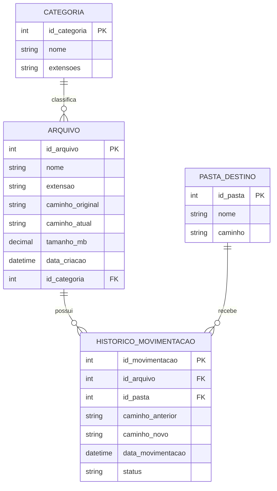

# 📁 Organizador de Arquivos em Python

## 📌 Descrição

Este projeto é uma automação desenvolvida em Python que organiza arquivos automaticamente em pastas de acordo com sua extensão.

O objetivo é praticar lógica de programação, manipulação de arquivos e automação de tarefas usando Python.

---

## 🎯 Objetivo

Criar um script simples e funcional capaz de organizar arquivos de forma automática, separando documentos, imagens, PDFs, planilhas e arquivos compactados.

---

## 🚀 Tecnologias Utilizadas

- Python
- Biblioteca os
- Biblioteca shutil

---

## 💡 Funcionalidades

- Verifica arquivos dentro da pasta `arquivos`
- Identifica a extensão de cada arquivo
- Cria pastas automaticamente
- Move os arquivos para suas categorias
- Organiza arquivos em:
  - Imagens
  - Documentos
  - PDFs
  - Planilhas
  - Compactados
  - Outros

---

## 📂 Estrutura do Projeto

```text
organizador-de-arquivos-python/
├── organizador.py
└── README.md

## 🗄️ Banco de Dados (MER) — Organizador de Arquivos



### 📌 Explicação do MER

Este modelo representa a estrutura de dados de um sistema organizador de arquivos.

- **Arquivo**: armazena informações dos arquivos encontrados.
- **Categoria**: classifica os arquivos por tipo, como imagens, documentos, vídeos e compactados.
- **Pasta_Destino**: define para onde os arquivos serão movidos.
- **Historico_Movimentacao**: registra cada movimentação feita pelo sistema.

### 🔗 Relacionamentos

- Uma categoria pode classificar vários arquivos.
- Um arquivo pode ter várias movimentações no histórico.
- Uma pasta de destino pode receber várias movimentações.
